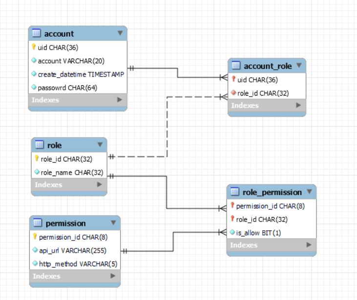

# 目的
使用Spring Security 實作基礎的帳號登入和角色權限管理  
建置依賴環境 :  
&ensp; MariaDB 10.6.3  
&ensp; Redis  

## 初始化 
1.需自行依照建置環境,重新設定[application.yml](src/main/resources/application.yml)中的MariaDB和Redis參數  
2.建置資料庫可手動執行[schema.sql](src/main/resources/sql/schema.sql)  
3.執行測試案例 SpringBootBaseProjectApplicationTests，預設會建立root 和 user 帳號  


## 執行方式

編譯打包完成後執行,jar檔名稱依照打包結果自行替換

```shell
java -jar SpringBootBaseProject-0.0.1.jar
```

打開瀏覽器輸入

```shell
http://127.0.0.1:8080/
```

Swagger 位置

```shell
http://localhost:8080/swagger-ui/index.html
```
## 登入和註冊相關說明

##### 流程說明


##### DB DIAGRAM


## 權限說明
一個帳號只允許設定一個角色  
一個角色可設定多個API的權限

##### 流程說明


##### DB DIAGRAM


##### permission id 定義說明
目前總共8碼
前4碼用作分群,後4碼用作編號


##### API URL範例

資料表 permission.api_url 會用來作為正則表達式來判斷對應的API path 是否有權限

如 GET /user,api_url 可設置如下

```shell
/user
```

或 GET /user/{account},api_url 可設置如下

```shell
/user/[\w]+
```


## 參考文章
#####  Spring
* [Spring Boot Web @RestControllerAdvice與@ControllerAdvice區別](https://matthung0807.blogspot.com/2020/12/spring-boot-web-restcontrolleradvice-controlleradvice-difference.html)
* [No EntityManager with actual transaction available for current thread](https://www.cnblogs.com/sxdcgaq8080/p/8984140.html)
* [Spring @Transactional 方法間呼叫的回滾範圍](https://matthung0807.blogspot.com/2020/11/spring-transactional-methods-call-rollback-boundaries.html)
* [Spring Security 的驗證與授權](https://chikuwa-tech-study.blogspot.com/2021/06/spring-boot-security-authentication-and-authorization.html)
* [SpringBoot 中使用 @Valid 注解 + Exception 全局处理器优雅处理参数验证](http://www.mydlq.club/article/49/)
* [聊聊spring security的permitAll以及webIgnore](https://segmentfault.com/a/1190000012160850)


##### Swagger
* [Spring boot 自動產生 OpenAPI 3.0 文件 (Swagger UI) 教學](https://www.ruyut.com/2022/05/spring-boot-openapi-3-swagger-ui.html)
* [springdoc官方文件](https://springdoc.org/)
* [最新版Swagger 3升级指南和新功能体验！](https://cloud.tencent.com/developer/article/1802047)

#####  JWT Token
* [jwt.io](https://jwt.io/)
* [JSON Web Token 入门教程](http://www.ruanyifeng.com/blog/2018/07/json_web_token-tutorial.html)
* [How to log out when using JWT](https://medium.com/devgorilla/how-to-log-out-when-using-jwt-a8c7823e8a6)

#####  Redis
* [Spring Boot EP 17：使用Redis記憶體資料庫實現快取機制](https://jovepater.com/article/spring-boot-ep-17-redis-cache/)


#####  Other
* [Eclipse 安装 lombok – 讓撰寫 JAVA 程式更加優雅簡潔](https://polinwei.com/lombok-install-in-eclipse/)


